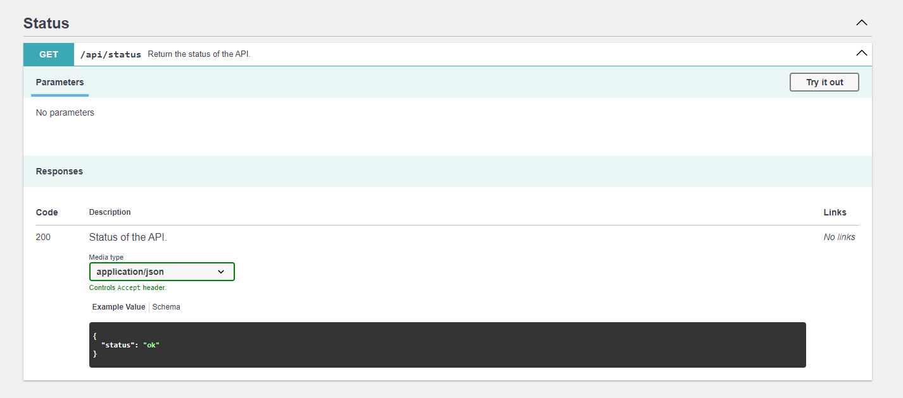

# Extended Api Doc Bundle #

An extension for `nelmio/api-doc-bundle` that improves the sorting of endpoints by tags and provides minor stylistic corrections to the original Nelmio view.

## Installation

Required bundles:

```bash
composer require symfony/asset
composer require symfony/twig-bundle
composer require nelmio/api-doc-bundle
composer require pbaszak/extended-api-doc-bundle
```

Routing Registration:

- /api/doc
- /api/doc.json
- /api/doc.yaml

```yaml
# config/routes.yaml
...
extended_api_doc:
    resource: '@ExtendedApiDocBundle/Resources/routes/*'
```

Setup metainfo:

```yaml
# config/packages/nelmio_api_doc.yaml
parameters:
    app_title: '%env(APP_TITLE)%'
    app_description: '%env(APP_DESCRIPTION)%'
    app_version: '%env(APP_VERSION)%'
    app_commit_sha_short: '%env(APP_COMMIT_SHA_SHORT)%'

nelmio_api_doc:
    documentation:
        info:
            title: '%app_title%'
            description: '%app_description%'
            version: '%app_version% (%app_commit_sha_short%)'
    areas: # to filter documented areas
        path_patterns:
            - ^/api(?!/doc(.json|.yaml)?$)
```

## Usage

Just open `/api/doc` path on Your server and enjoy!



## Development

### How to start

Start local environment using this command:
```sh
bash start.sh
```

### How to use **Standard Version**

If You don't have node_modules directory run:
```sh
npm install
```

`Major`, `Minor`, `Patch` version update:
```sh
npm run version:major
# or
npm run version:minor
# or
npm run version:patch
```

Push tags:
```sh
npm run version:release
# or
npm run release
```

Check `package.json` for understand what commands do.

### How to use **PHPStan**

Main command:
```bash
docker exec php composer code:analyse
```
but, if You need to add errors to ignored:
```bash
docker exec php composer code:analyse:b
```

### How to use **PHP CS Fixer**

```bash
docker exec php composer code:fix
```

### How to use **XDebug** in **Visual Studio Code**

Create new file in Your project: `.vscode/launch.json`
```json
{
    "version": "0.2.0",
    "configurations": [
        {
            "name": "Listen for xDebug",
            "type": "php",
            "request": "launch",
            "port": 5902,
            "hostname": "0.0.0.0",
            "pathMappings": {
                "/app/": "${workspaceRoot}"
            }
        }
    ]
}
```

Uncomment environments in `.env.local`:
```env
XDEBUG_MODE=develop,debug
XDEBUG_CONFIG=" client_port=5902 idekey=VSCODE client_host=host.docker.internal discover_client_host=0 start_with_request=yes"
```

Type `Ctrl + Shift + D` and run `Listen for xDebug`.
